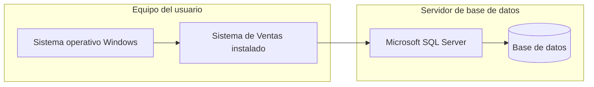

# 5. Arquitectura del Sistema

## Modelo de capas

El sistema sigue una **arquitectura en capas** organizada en cuatro proyectos principales:

- **CapaEntidad**: contiene las entidades del negocio y sus relaciones.
- **CapaDatos**: accede a la base de datos y ejecuta los comandos SQL/Stored Procedures.
- **CapaNegocio**: aplica reglas de negocio, validaciones y coordina el acceso a datos.
- **CapaPresentacion**: muestra la interfaz de usuario y consume la lógica de negocio.

## Diagrama de clases

```mermaid
classDiagram
    direction LR

    class Rol {
        +int IdRol
        +string Descripcion
        +string FechaRegistro
    }

    class Permiso {
        +int IdPermiso
        +string NombreMenu
        +string FechaRegistro
    }

    class Usuario {
        +int IdUsuario
        +string Documento
        +string NombreCompleto
        +string Correo
        +string Clave
        +bool Estado
        +string FechaRegistro
    }

    class Categoria {
        +int IdCategoria
        +string Descripcion
        +bool Estado
        +string FechaRegistro
    }

    class Producto {
        +int IdProducto
        +string Codigo
        +string Nombre
        +string Descripcion
        +int Stock
        +decimal PrecioCompra
        +decimal PrecioVenta
        +bool Estado
        +string FechaRegistro
    }

    class Cliente {
        +int IdCliente
        +string Documento
        +string NombreCompleto
        +string Correo
        +string Telefono
        +bool Estado
        +string FechaRegistro
    }

    class Proveedor {
        +int IdProveedor
        +string Documento
        +string RazonSocial
        +string Correo
        +string Telefono
        +bool Estado
        +string FechaRegistro
    }

    class Venta {
        +int IdVenta
        +string TipoDocumento
        +string NumeroDocumento
        +string DocumentoCliente
        +string NombreCliente
        +decimal MontoPago
        +decimal MontoCambio
        +decimal MontoTotal
        +string FechaRegistro
    }

    class Detalle_Venta {
        +int IdDetalleVenta
        +decimal PrecioVenta
        +int Cantidad
        +decimal SubTotal
        +string FechaRegistro
    }

    class Compra {
        +int IdCompra
        +string TipoDocumento
        +string NumeroDocumento
        +decimal MontoTotal
        +string FechaRegistro
    }

    class Detalle_Compra {
        +int IdDetalleCompra
        +decimal PrecioCompra
        +decimal PrecioVenta
        +int Cantidad
        +decimal MontoTotal
        +string FechaRegistro
    }

    class Negocio {
        +int IdNegocio
        +string Nombre
        +string RUC
        +string Direccion
    }

    class CN_Usuario {
        +Listar()
        +Autenticar()
        +Registrar()
        +Editar()
        +Eliminar()
    }

    class CN_Producto {
        +Listar()
        +Registrar()
        +Editar()
        +Eliminar()
    }

    class CN_Cliente {
        +Listar()
        +Registrar()
        +Editar()
        +Eliminar()
    }

    class CN_Proveedor {
        +Listar()
        +Registrar()
        +Editar()
        +Eliminar()
    }

    class CN_Categoria {
        +Listar()
        +Registrar()
        +Editar()
        +Eliminar()
    }

    class CN_Venta {
        +RestarStock()
        +SumarStock()
        +ObtenerCorrelativo()
        +Registrar()
        +ObtenerVenta()
    }

    class CN_Compra {
        +ObtenerCorrelativo()
        +Registrar()
        +ObtenerCompra()
    }

    class CN_Reporte {
        +Compra()
        +Venta()
    }

    class CN_Negocio {
        +ObtenerDatos()
        +GuardarDatos()
        +ObtenerLogo()
        +ActualizarLogo()
    }

    class CN_Rol {
        +Listar()
    }

    class CN_Permiso {
        +Listar()
    }

    class CD_Usuario {
        +Listar()
        +Registrar()
        +Editar()
        +Eliminar()
    }

    class CD_Producto {
        +Listar()
        +Registrar()
        +Editar()
        +Eliminar()
    }

    class CD_Cliente {
        +Listar()
        +Registrar()
        +Editar()
        +Eliminar()
    }

    class CD_Proveedor {
        +Listar()
        +Registrar()
        +Editar()
        +Eliminar()
    }

    class CD_Categoria {
        +Listar()
        +Registrar()
        +Editar()
        +Eliminar()
    }

    class CD_Venta {
        +RestarStock()
        +SumarStock()
        +ObtenerCorrelativo()
        +Registrar()
        +ObtenerVenta()
    }

    class CD_Compra {
        +ObtenerCorrelativo()
        +Registrar()
        +ObtenerCompra()
        +ObtenerDetalleCompra()
    }

    class CD_Reporte {
        +Compra()
        +Venta()
    }

    class CD_Negocio {
        +ObtenerDatos()
        +GuardarDatos()
        +ObtenerLogo()
        +ActualizarLogo()
    }

    class CD_Rol {
        +Listar()
    }

    class CD_Permiso {
        +Listar()
    }

    Rol "1" --> "0..*" Usuario
    Rol "1" --> "0..*" Permiso
    Categoria "1" --> "0..*" Producto
    Usuario "1" --> "0..*" Venta
    Usuario "1" --> "0..*" Compra
    Proveedor "1" --> "0..*" Compra
    Venta "1" --> "1..*" Detalle_Venta
    Compra "1" --> "1..*" Detalle_Compra
    Producto "1" --> "0..*" Detalle_Venta
    Producto "1" --> "0..*" Detalle_Compra

    CN_Usuario --> CD_Usuario
    CN_Producto --> CD_Producto
    CN_Cliente --> CD_Cliente
    CN_Proveedor --> CD_Proveedor
    CN_Categoria --> CD_Categoria
    CN_Venta --> CD_Venta
    CN_Compra --> CD_Compra
    CN_Reporte --> CD_Reporte
    CN_Negocio --> CD_Negocio
    CN_Rol --> CD_Rol
    CN_Permiso --> CD_Permiso
```

## Diagrama de despliegue

# 6. Tecnologías Utilizadas

- **Lenguaje de programación:** C#
- **Framework / plataforma:** .NET Framework 4.7.2
- **IDE:** Visual Studio 2022
- **Interfaz gráfica:** Windows Forms
- **Gestor de base de datos:** Microsoft SQL Server
- **Acceso a datos:** ADO.NET
- **Patrón arquitectónico:** Arquitectura en capas
